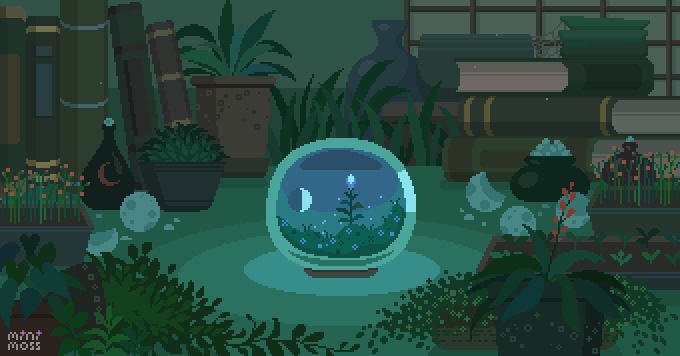

# 🌿✨ Kelvin Vu — GitHub Portfolio
<!-- Banner Image --> 
  

# 👋 Welcome to My GitHub Portfolio!

I’m Kelvin Vu, a proactive and goal-driven aspiring Computer Science professional with strengths in time management, problem-solving, and adaptability. I'm recognized for reliability, fast learning, and a genuine passion for innovation and collaboration.

I strive to build impactful, well-structured solutions—whether through machine learning, security analysis, or large-scale network systems. I’m excited to continue growing my technical expertise while contributing meaningfully to team success and organizational goals.

---

## 🛠️ Skills & Tools

               

---

## 🚀 Featured Projects

### [Diabetes ML Prediction](https://github.com/kllyph/diabetes-ml-prediction)
A machine learning model that predicts diabetes outcomes using structured clinical data. Includes preprocessing, feature engineering, and model evaluation.

### [Malware Hacking Lab](https://github.com/Giacalone-CECS/cecs-478-sp25-02-lab-02-malware-hacking-Kuovox)
Hands-on malware analysis labs focused on exploit behavior, disassembly, and secure coding practices.

---

## 💡 Interests

- 🕵️‍♂️ **Cybersecurity & Ethical Hacking**
- 🤖 **Machine Learning & Data Analysis**
- 🏫 **Tau Beta Pi Officer** – Organized chapter operations, events, and outreach
- 📘 **ISC2 CC Certification (in progress)**
- ⚒️ **Open Source Contributions**
- 🌱 **Continuous Learning & Skill Building**

---

## 📊 GitHub Stats

  <!-- Overall stats card -->
  
  <!-- Top languages by commits -->
  

## 🔥GitHub Streaks

  

## 🏅 GitHub Trophies

  

---

## 🤝 Connect With Me

   

Feel free to reach out for collaboration, networking, or just to chat about tech!

---

## 📁 About This Repo
This repository serves as a curated hub for my GitHub presence—highlighting my areas of interest, technical projects, and professional development. Feel free to explore my repositories and connect if you'd like to collaborate or chat about tech!

---

<em>Thanks for stopping by! 🌱✨</em>

